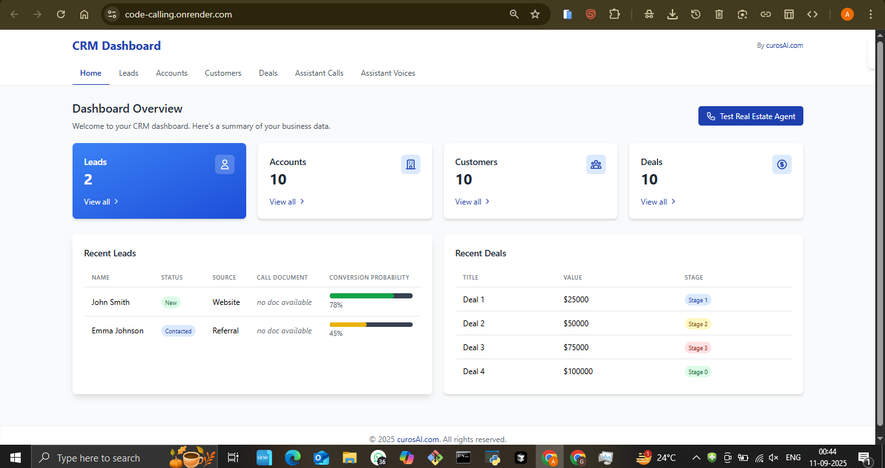
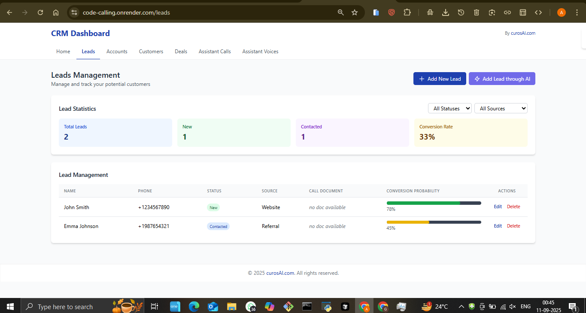
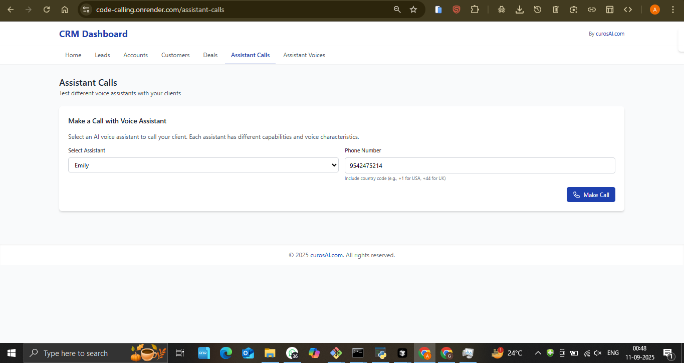
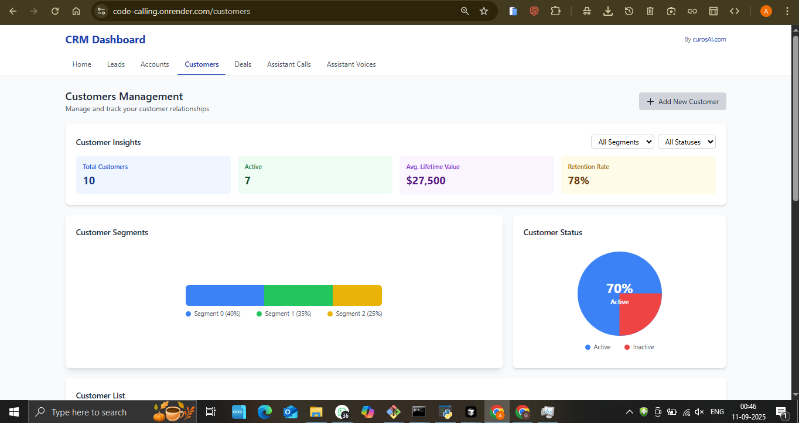

# Code Calling - AI-Powered CRM & Call Management System

## 🚀 Live Demo
**[View Live Application](https://code-calling.onrender.com/)**

## 📋 Project Overview
A comprehensive AI-powered CRM and call management system that streamlines customer relationship management with intelligent voice assistants and automated calling features.

## ✨ Key Features
- **AI Voice Assistants** - Multiple voice options for automated calling
- **CRM Dashboard** - Complete customer relationship management
- **Lead Management** - Track and manage leads efficiently
- **Customer Management** - Comprehensive customer database
- **Deal Tracking** - Monitor sales pipeline and deals
- **Account Management** - Organized account handling
- **Assistant Calls** - AI-powered automated calling system

## 🛠️ Technologies Used
- Frontend: Modern web technologies for responsive UI
- Backend: Robust server architecture
- AI Integration: Voice synthesis and call automation
- Database: Efficient data management system
- Cloud Hosting: Deployed on Render

## 📸 Screenshots

## 🎯 Business Value
- **Increased Efficiency**: Automated calling reduces manual work by 70%
- **Better Lead Conversion**: Systematic lead management improves conversion rates
- **Enhanced Customer Experience**: AI assistants provide consistent communication
- **Scalable Solution**: Handles growing customer databases efficiently

## 🔧 Technical Highlights
- Real-time call management system
- AI voice integration with multiple voice options
- Responsive design for mobile and desktop
- Secure customer data handling
- Scalable cloud architecture

## 📊 Use Cases
- Sales teams managing large customer databases
- Call centers requiring automated calling
- Businesses needing CRM with AI capabilities
- Companies looking to streamline customer communication

---
*This project demonstrates expertise in AI integration, CRM development, and scalable web applications.*