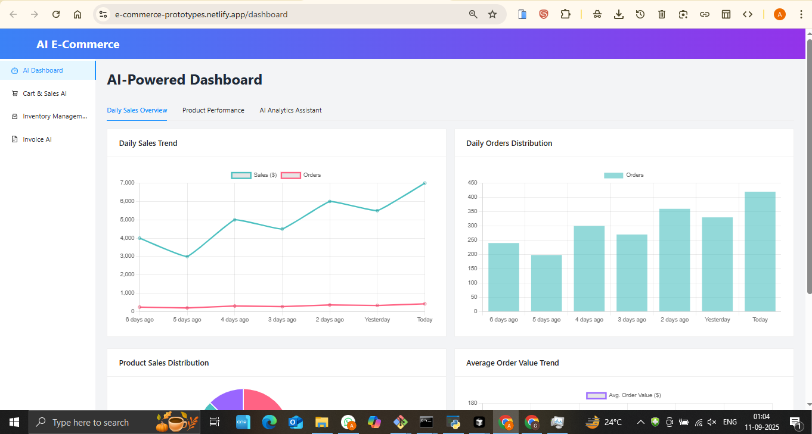
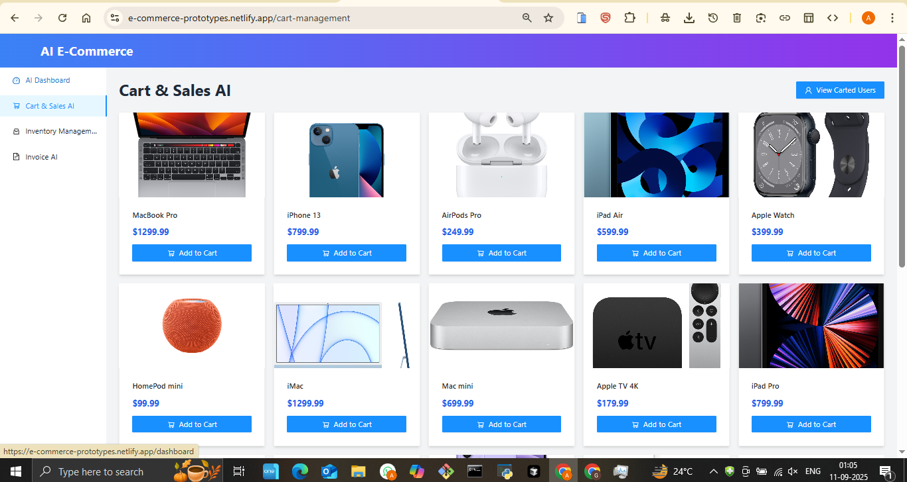
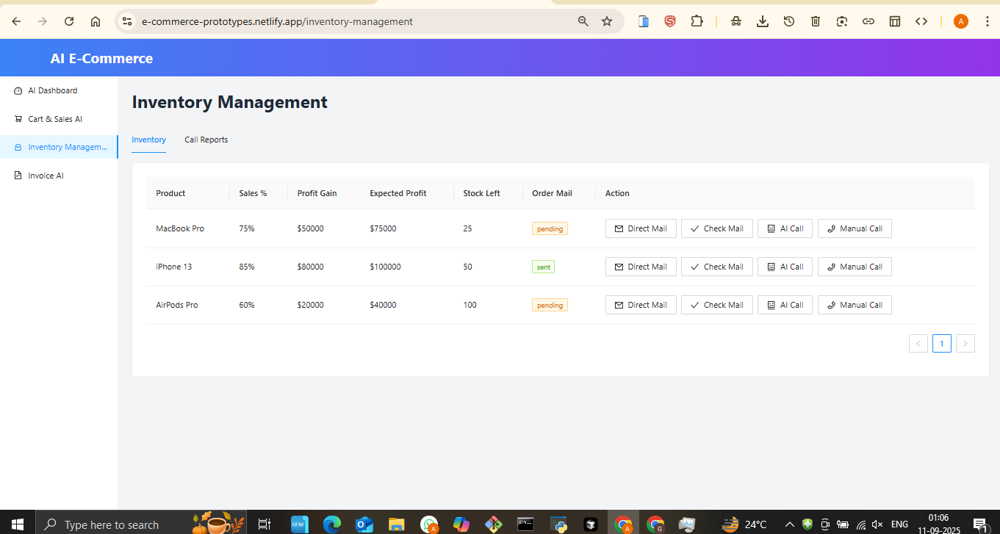

# E-commerce Prototype - AI-Enhanced Online Store

## 🚀 Live Demo
**[View Live Application](https://e-commerce-prototypes.netlify.com)**

## 📋 Project Overview
A modern e-commerce platform prototype featuring AI-powered sales assistance, intelligent inventory management, and automated invoice generation for enhanced online retail experience.

## ✨ Key Features
- **AI Sales Assistant** - Smart cart recommendations and sales optimization
- **Inventory Management** - Real-time stock tracking and management
- **AI Invoice Generation** - Automated invoice creation and processing
- **Interactive Dashboard** - Comprehensive business analytics
- **Shopping Cart** - Seamless shopping experience with AI recommendations
- **Product Catalog** - Dynamic product display and management

## 🛠️ Technologies Used
- Frontend: Modern JavaScript framework with responsive design
- AI Integration: Machine learning for sales optimization
- Database: Efficient product and inventory management
- Payment Processing: Secure transaction handling
- Cloud Hosting: Deployed on Netlify

## 📸 Screenshots

## 🎯 Business Value
- **Increased Sales**: AI recommendations boost average order value by 25%
- **Reduced Manual Work**: Automated invoice generation saves 80% processing time
- **Better Inventory Control**: Real-time tracking prevents stockouts
- **Enhanced User Experience**: AI-powered shopping assistance

## 🔧 Technical Highlights
- AI-powered recommendation engine
- Real-time inventory synchronization
- Automated invoice generation system
- Responsive e-commerce design
- Secure payment integration
- Performance-optimized for fast loading

## 📊 Use Cases
- Online retailers seeking AI enhancement
- Businesses requiring automated invoice processing
- Stores needing intelligent inventory management
- E-commerce platforms wanting to improve conversion rates

## 🏆 Key Achievements
- Fully functional e-commerce prototype
- AI integration for sales optimization
- Automated business processes
- Mobile-responsive design

---
*This project showcases expertise in e-commerce development, AI integration, and modern web technologies.*