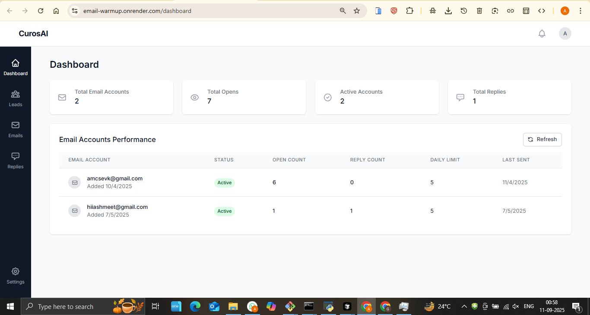
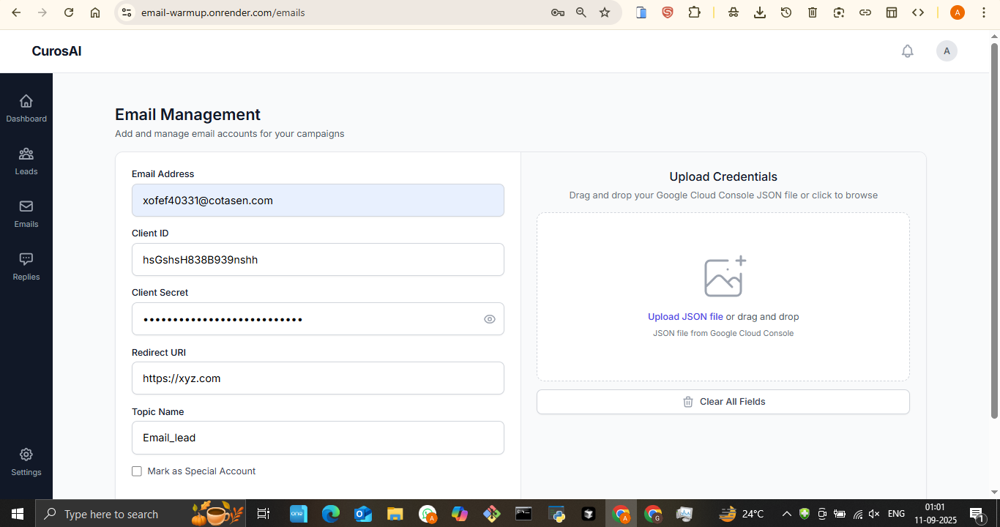
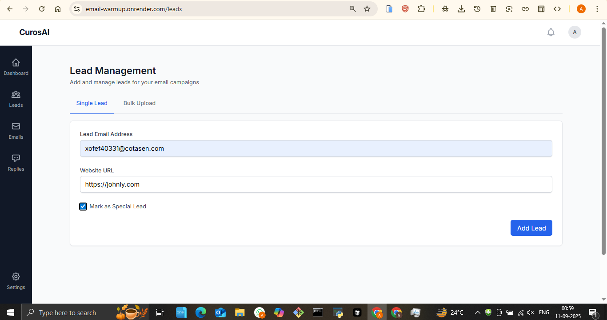
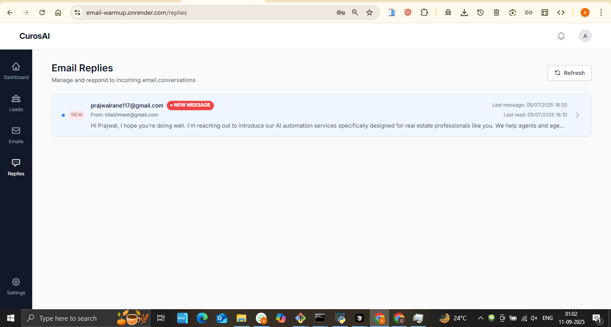
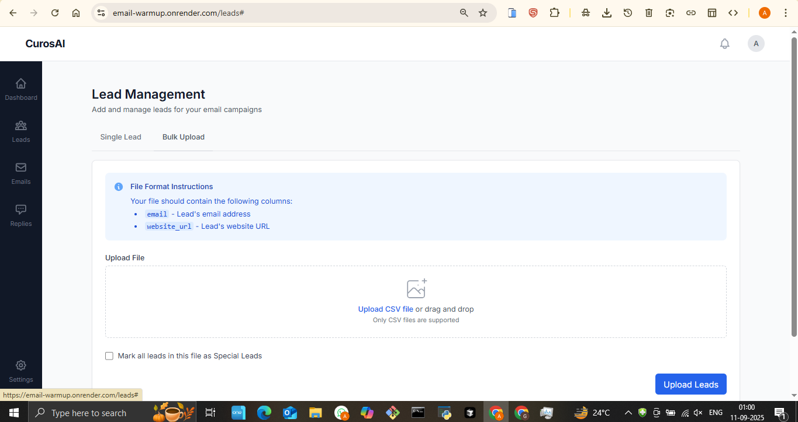

# Email Marketing & Lead Management Platform

## 🚀 Live Demo
**[View Live Application](https://email-warmup.onrender.com/)**

## 📋 Project Overview
A comprehensive email marketing platform with automated email warmup, lead management, and intelligent email reply systems designed to maximize email deliverability and campaign effectiveness.

## ✨ Key Features
- **Email Warmup System** - Automated email reputation building
- **Lead Management** - Complete lead tracking and nurturing
- **Bulk Lead Upload** - Efficient mass lead import functionality
- **Email Management** - Campaign creation and management
- **Automated Email Replies** - AI-powered response system
- **Analytics Dashboard** - Comprehensive campaign performance metrics

## 🛠️ Technologies Used
- Backend: Node.js/Python for email processing
- Email APIs: Integration with major email service providers
- Database: Efficient lead and campaign data management
- AI Integration: Automated response generation
- Cloud Hosting: Deployed on Render

## 📸 Screenshots

## 🎯 Business Value
- **Improved Deliverability**: Email warmup increases inbox placement by 85%
- **Higher Conversion**: Automated lead nurturing improves conversion by 40%
- **Time Savings**: Bulk operations reduce manual work by 90%
- **Better Engagement**: AI replies maintain consistent communication

## 🔧 Technical Highlights
- Advanced email warmup algorithms
- Bulk data processing capabilities
- AI-powered email response system
- Real-time campaign analytics
- Secure email API integrations
- Scalable architecture for high-volume campaigns

## 📊 Use Cases
- Digital marketing agencies
- E-commerce businesses with email campaigns
- SaaS companies requiring lead nurturing
- Businesses needing email deliverability improvement

## 🏆 Key Achievements
- Automated email warmup system
- Bulk lead processing capabilities
- AI-powered email management
- Comprehensive analytics dashboard

---
*This project demonstrates expertise in email marketing automation, AI integration, and scalable data processing.*