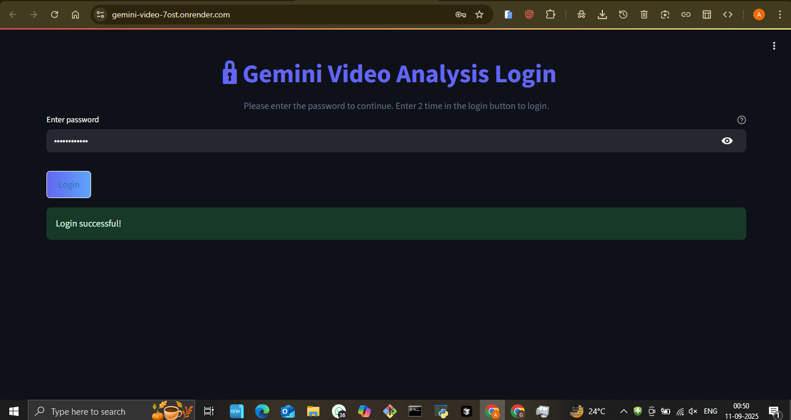
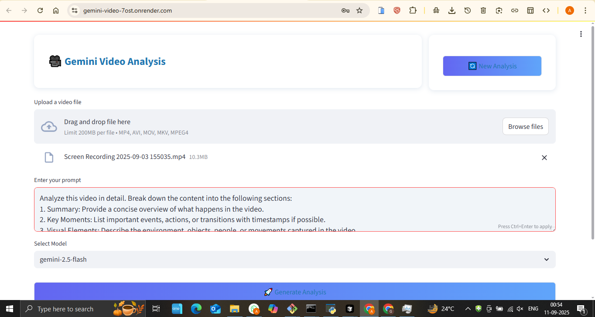
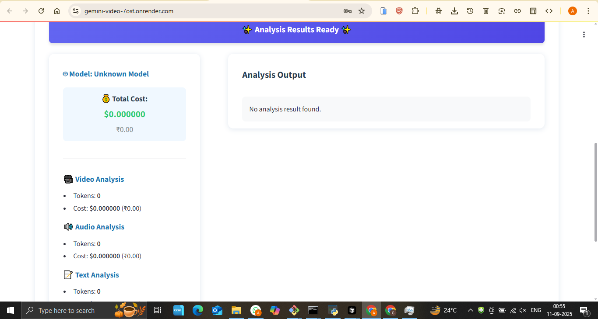

# Gemini Video Analysis - AI-Powered Video Intelligence

## 🚀 Live Demo
**[View Live Application](https://gemini-video-7ost.onrender.com/)**

## 📋 Project Overview
An advanced video analysis platform powered by Google's Gemini AI, capable of analyzing videos for multiple purposes including content understanding, object detection, and intelligent insights extraction.

## ✨ Key Features
- **Multi-Purpose Video Analysis** - Versatile analysis for different use cases
- **AI-Powered Insights** - Deep content understanding using Gemini AI
- **Secure Login System** - User authentication and session management
- **Detailed Results** - Comprehensive analysis reports
- **Real-time Processing** - Fast video analysis and results generation
- **Multiple Analysis Types** - Content, object, and behavior analysis

## 🛠️ Technologies Used
- AI Engine: Google Gemini AI for video analysis
- Backend: Robust server architecture for video processing
- Frontend: Modern web interface for easy interaction
- Video Processing: Advanced video handling and analysis
- Cloud Hosting: Deployed on Render

## 📸 Screenshots

## 🎯 Business Value
- **Content Moderation**: Automated video content analysis for platforms
- **Security Applications**: Intelligent surveillance and monitoring
- **Marketing Insights**: Video content performance analysis
- **Educational Tools**: Automated video content categorization

## 🔧 Technical Highlights
- Integration with Google Gemini AI
- Advanced video processing algorithms
- Real-time analysis capabilities
- Secure user authentication
- Scalable cloud architecture
- Multiple analysis output formats

## 📊 Use Cases
- Content creators analyzing video performance
- Security companies requiring video monitoring
- Educational platforms needing content analysis
- Marketing teams analyzing video campaigns
- Social media platforms for content moderation

## 🏆 Key Achievements
- Successful Gemini AI integration
- Multi-purpose video analysis system
- Real-time processing capabilities
- Comprehensive analysis reporting

---
*This project showcases expertise in AI integration, video processing, and advanced machine learning applications.*