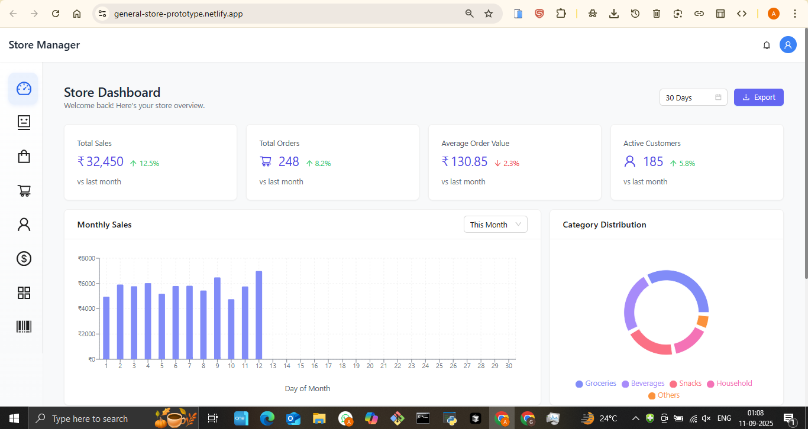
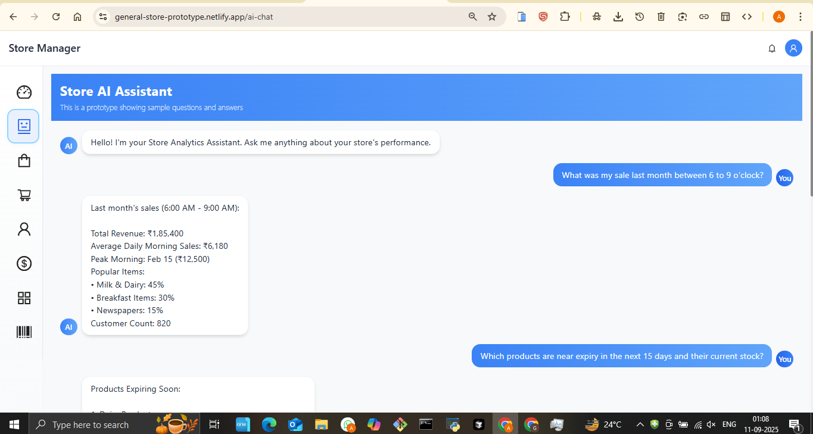
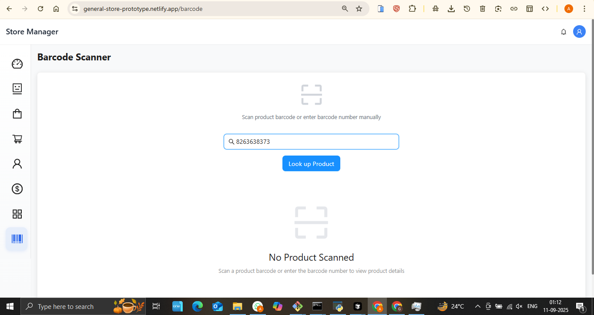
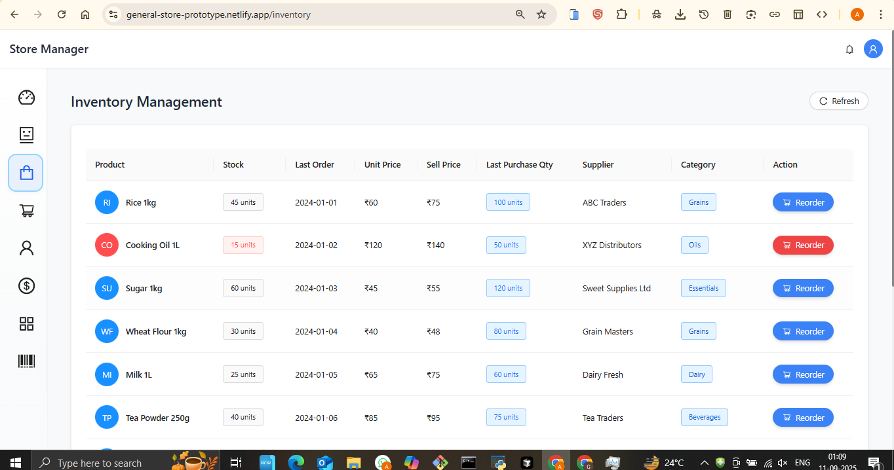
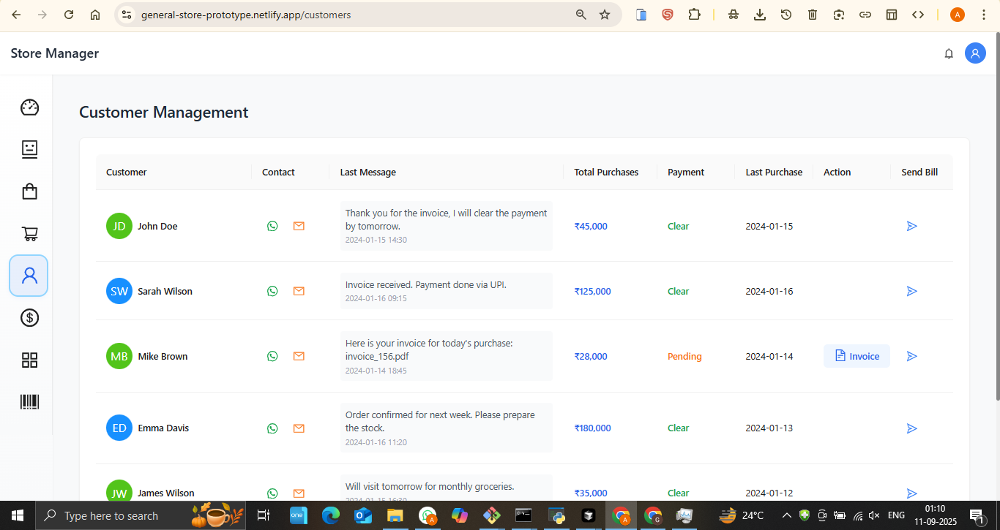
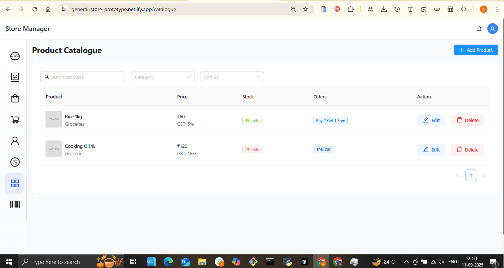
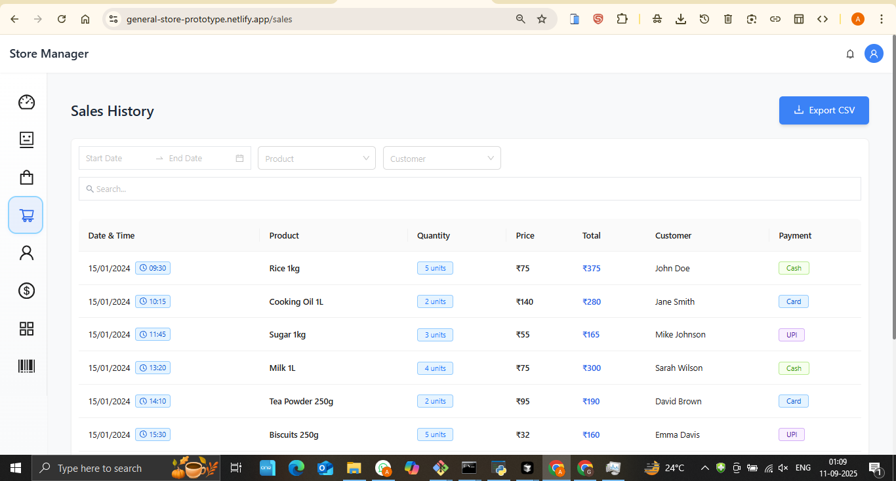
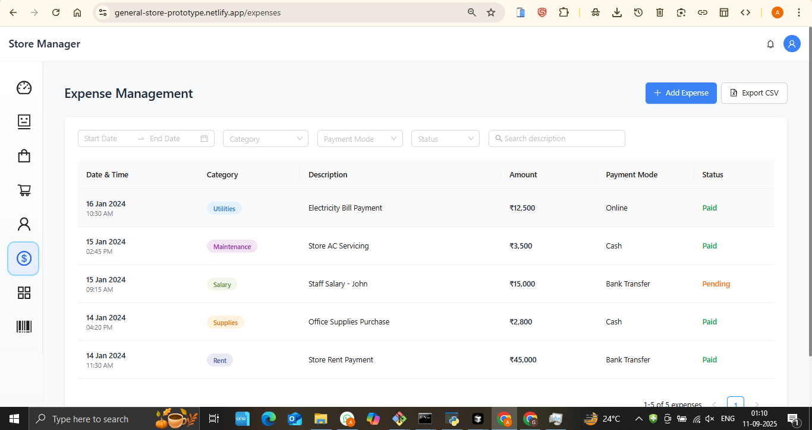

# General Store Management System - Complete Retail Solution

## 🚀 Live Demo
**[View Live Application](https://general-store-prototype.netlify.app/)**

## 📋 Project Overview
A comprehensive retail management system designed for general stores, featuring AI assistance, barcode scanning, inventory management, and complete business operations automation.

## ✨ Key Features
- **AI Store Assistant** - Intelligent customer service and store management
- **Barcode Scanner** - Quick product identification and inventory updates
- **Inventory Management** - Real-time stock tracking and alerts
- **Customer Management** - Complete customer database and history
- **Product Catalogue** - Dynamic product display and management
- **Sales History** - Detailed sales tracking and analytics
- **Expense Management** - Business expense tracking and reporting
- **Interactive Dashboard** - Comprehensive business overview

## 🛠️ Technologies Used
- Frontend: Modern web technologies with responsive design
- Barcode Integration: Camera-based scanning functionality
- AI Integration: Intelligent store assistant
- Database: Comprehensive business data management
- Cloud Hosting: Deployed on Netlify

## 📸 Screenshots

## 🎯 Business Value
- **Operational Efficiency**: Reduces manual work by 80% with automation
- **Better Inventory Control**: Prevents stockouts and overstocking
- **Enhanced Customer Service**: AI assistant improves customer experience
- **Data-Driven Decisions**: Analytics help optimize business operations

## 🔧 Technical Highlights
- Camera-based barcode scanning
- AI-powered store assistant
- Real-time inventory synchronization
- Comprehensive business analytics
- Mobile-responsive design
- Offline capability for critical functions

## 📊 Use Cases
- Small to medium retail stores
- Convenience stores and supermarkets
- Pharmacy and medical stores
- Hardware and electronics stores
- Any retail business requiring complete management

## 🏆 Key Achievements
- Complete retail management solution
- AI integration for customer service
- Barcode scanning functionality
- Comprehensive business analytics
- Mobile-optimized interface

---
*This project demonstrates expertise in retail systems, AI integration, and comprehensive business management solutions.*