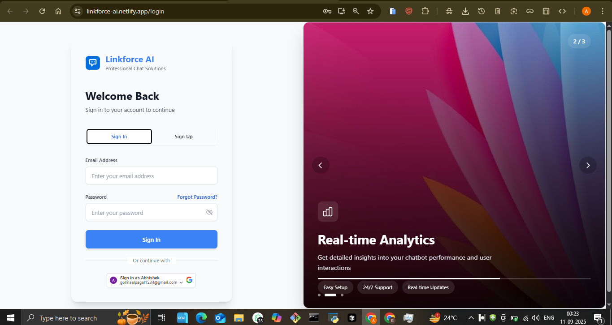
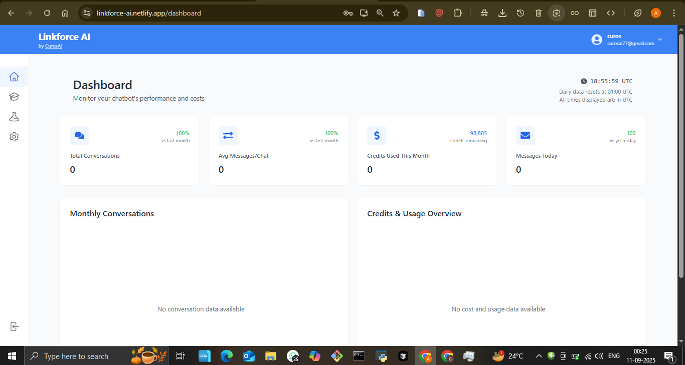
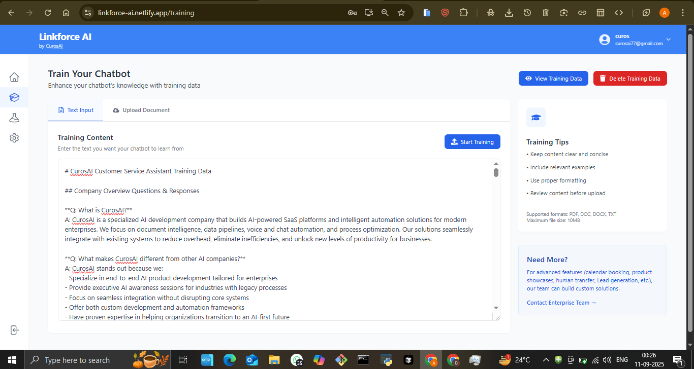
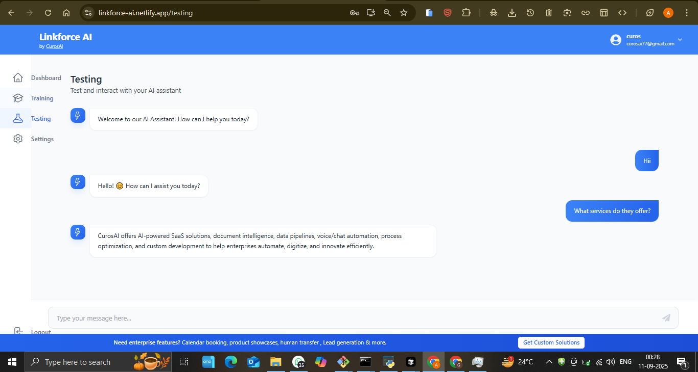
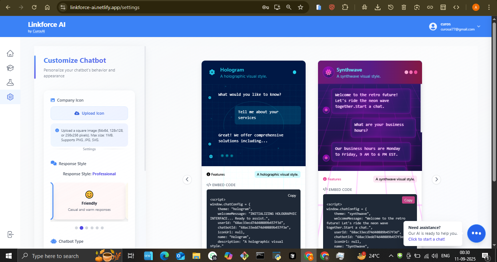

# LinkForce AI - Advanced Chatbot Platform

## 🚀 Live Demo
**[View Live Application](https://linkforce-ai.netlify.app/)**

## 📋 Project Overview
A comprehensive AI chatbot platform that enables businesses to create, train, and deploy intelligent chatbots with customizable themes, advanced testing capabilities, and seamless integration options.

## ✨ Key Features
- **Chatbot Creation & Training** - Build and train custom AI chatbots
- **Multiple Themes** - Customizable chatbot appearance and branding
- **Advanced Testing** - Comprehensive chatbot testing environment
- **Interactive Dashboard** - Complete chatbot management interface
- **Secure Authentication** - User login and session management
- **Real-time Chat** - Instant chatbot responses and interactions

## 🛠️ Technologies Used
- AI Engine: Advanced natural language processing
- Frontend: Modern web technologies with responsive design
- Backend: Robust chatbot training and deployment system
- Database: Conversation and training data management
- Cloud Hosting: Deployed on Netlify

## 📸 Screenshots

## 🎯 Business Value
- **24/7 Customer Support**: Automated customer service reduces support costs by 70%
- **Improved Response Time**: Instant responses increase customer satisfaction
- **Scalable Solution**: Handle unlimited concurrent conversations
- **Brand Consistency**: Customizable themes maintain brand identity

## 🔧 Technical Highlights
- Advanced NLP and AI integration
- Real-time chatbot training capabilities
- Customizable theme system
- Comprehensive testing environment
- Secure user authentication
- Scalable chat infrastructure

## 📊 Use Cases
- Customer service automation
- E-commerce product assistance
- Lead generation and qualification
- FAQ automation
- Educational and training platforms
- Healthcare patient support

## 🏆 Key Achievements
- Complete chatbot development platform
- Advanced AI training system
- Customizable branding options
- Comprehensive testing tools
- User-friendly interface

## 💼 Business Applications
- **Customer Support**: Automate common customer inquiries
- **Sales Assistance**: Guide customers through purchase decisions
- **Lead Generation**: Qualify and capture potential customers
- **Internal Support**: Employee assistance and HR queries

---
*This project demonstrates expertise in AI chatbot development, NLP, and scalable customer service solutions.*