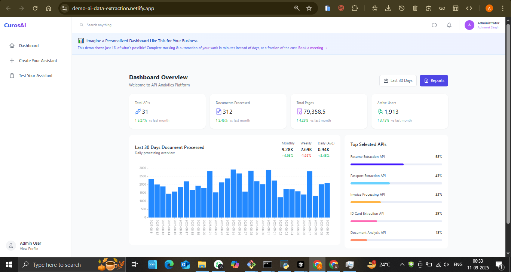
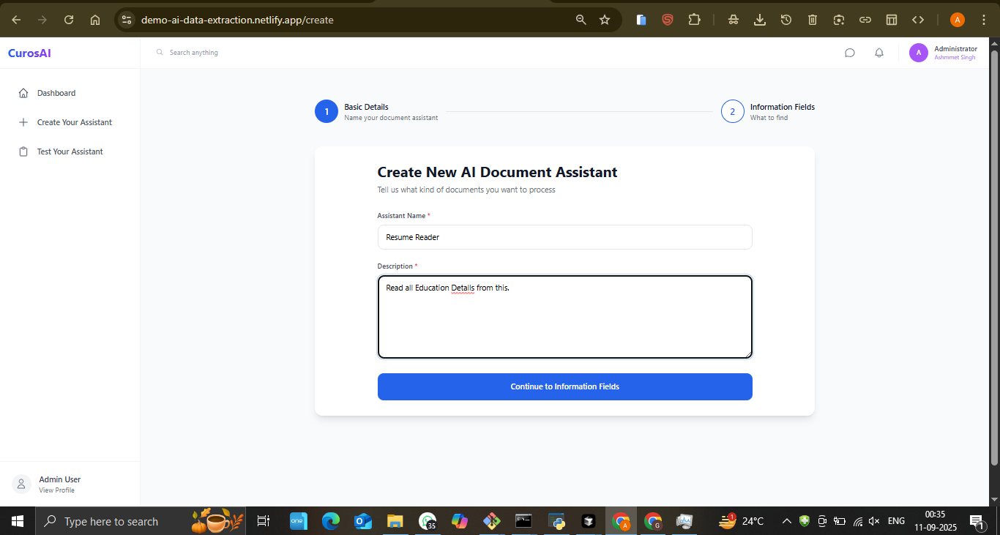
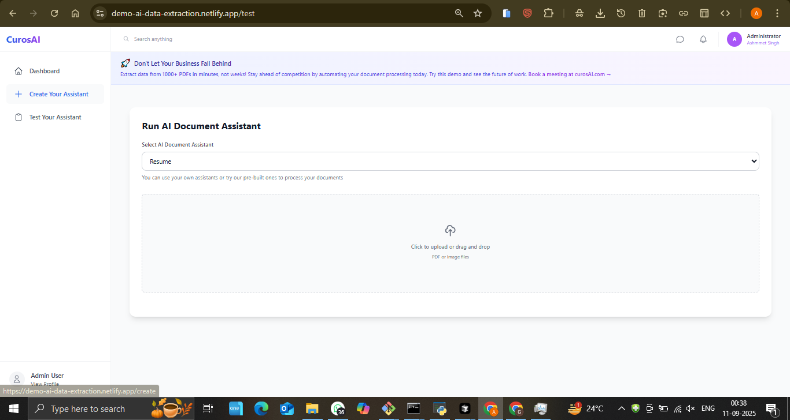

# AI Data Extraction - Intelligent JSON Extractor

## 🚀 Live Demo
**[View Live Application](https://demo-ai-data-extraction.netlify.app/test)**

## 📋 Project Overview
An intelligent data extraction platform that uses AI to automatically extract structured JSON data from various sources including documents, images, and unstructured text with high accuracy and customizable extraction rules.

## ✨ Key Features
- **AI-Powered Extraction** - Intelligent data parsing and extraction
- **Custom Assistant Creation** - Build specialized extraction assistants
- **JSON Output** - Structured data in standard JSON format
- **Assistant Testing** - Real-time testing and validation
- **Multiple Data Sources** - Support for various input formats
- **Interactive Dashboard** - User-friendly management interface

## 🛠️ Technologies Used
- AI Engine: Advanced machine learning for data extraction
- Backend: Robust data processing architecture
- Frontend: Modern web interface for easy interaction
- Data Processing: Advanced parsing and extraction algorithms
- Cloud Hosting: Deployed on Netlify

## 📸 Screenshots

## 🎯 Business Value
- **Automation**: Reduces manual data entry by 95%
- **Accuracy**: AI ensures consistent and accurate extraction
- **Scalability**: Handles large volumes of data efficiently
- **Cost Savings**: Eliminates need for manual data processing teams

## 🔧 Technical Highlights
- Advanced AI data extraction algorithms
- Customizable extraction rules
- Real-time processing capabilities
- JSON standardized output
- Multi-format input support
- Scalable cloud architecture

## 📊 Use Cases
- Document processing companies
- Data migration projects
- Financial institutions processing forms
- Healthcare organizations digitizing records
- Legal firms extracting contract data
- E-commerce platforms processing product data

## 🏆 Key Achievements
- AI-powered data extraction system
- Customizable assistant creation
- High accuracy extraction rates
- Scalable processing architecture

## 💼 Business Applications
- **Document Digitization**: Convert paper documents to structured data
- **Data Migration**: Extract data from legacy systems
- **Form Processing**: Automate form data extraction
- **Content Management**: Structure unorganized data

---
*This project showcases expertise in AI/ML, data processing, and intelligent automation systems.*