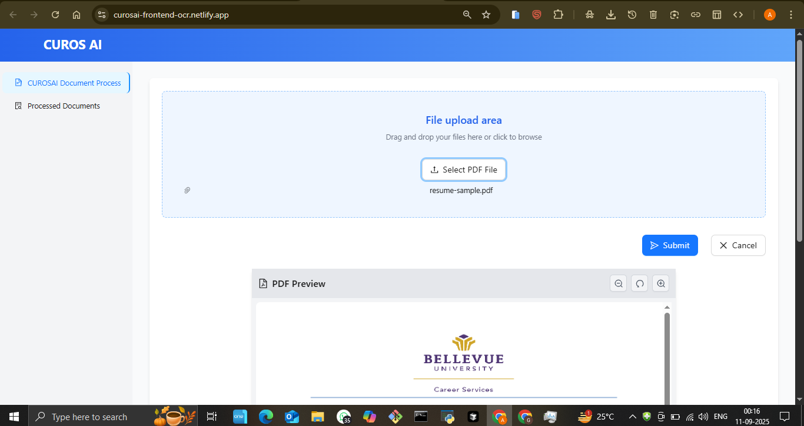
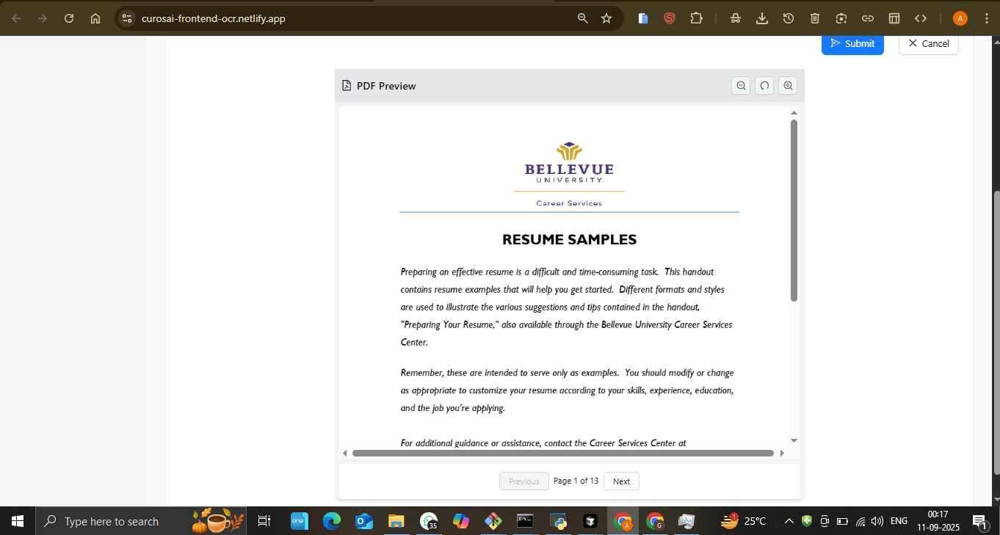
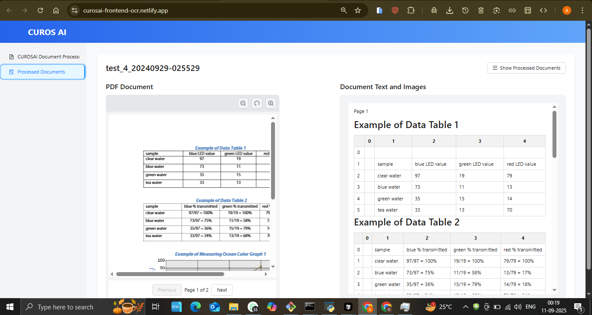

# OCR Pipeline - Intelligent Document Processing

## 🚀 Live Demo
**[View Live Application](https://curosai-frontend-ocr.netlify.com)**

## 📋 Project Overview
An advanced Optical Character Recognition (OCR) pipeline that intelligently processes documents, extracts text and data, and provides structured output for various document types with high accuracy and automated workflows.

## ✨ Key Features
- **Advanced OCR Processing** - High-accuracy text extraction from documents
- **Multi-Document Support** - Process various document formats (PDF, images, scanned docs)
- **Intelligent Data Extraction** - AI-powered data structuring and organization
- **Batch Processing** - Handle multiple documents simultaneously
- **Document Management** - Track and manage processed documents
- **Real-time Processing** - Fast document analysis and results

## 🛠️ Technologies Used
- OCR Engine: Advanced optical character recognition technology
- AI Integration: Machine learning for intelligent data extraction
- Backend: Robust document processing pipeline
- Frontend: Modern web interface for document upload and management
- Cloud Hosting: Deployed on Netlify

## 📸 Screenshots

## 🎯 Business Value
- **Digitization**: Convert paper documents to digital format
- **Automation**: Reduce manual data entry by 90%
- **Accuracy**: AI ensures high-precision text extraction
- **Efficiency**: Process hundreds of documents in minutes

## 🔧 Technical Highlights
- State-of-the-art OCR algorithms
- AI-powered data extraction and structuring
- Batch processing capabilities
- Multi-format document support
- Real-time processing pipeline
- Scalable cloud architecture

## 📊 Use Cases
- **Legal Firms**: Digitize contracts and legal documents
- **Healthcare**: Process medical records and forms
- **Finance**: Extract data from invoices and receipts
- **Government**: Digitize public records and applications
- **Education**: Process academic documents and transcripts
- **Insurance**: Handle claims and policy documents

## 🏆 Key Achievements
- High-accuracy OCR processing
- Intelligent data extraction system
- Batch processing capabilities
- Multi-format document support
- User-friendly interface

## 💼 Business Applications
- **Document Digitization**: Convert physical documents to digital
- **Data Entry Automation**: Eliminate manual data entry tasks
- **Archive Management**: Digitize and organize document archives
- **Compliance**: Ensure document accessibility and searchability

---
*This project showcases expertise in OCR technology, AI data extraction, and document processing automation.*